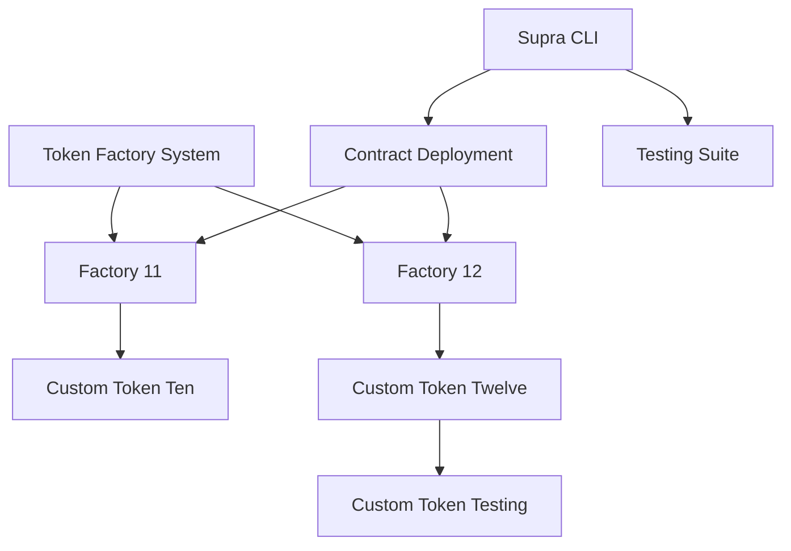

# Supra Smart Contract Testing Framework

A comprehensive testing framework for Supra's Move VM smart contracts, focusing on token factory patterns and custom token implementations.

## Table of Contents

- [Overview](#overview)
- [Architecture](#architecture)
- [Contract Components](#contract-components)
- [Testing Framework](#testing-framework)
- [Supra CLI Integration](#supra-cli-integration)
- [Getting Started](#getting-started)

## Overview

This repository contains a testing framework for Supra's Move VM smart contracts, specifically designed to validate token factory patterns and custom token implementations. The framework includes multiple factory versions (11 and 12) along with their corresponding custom token contracts.

## Architecture



### Core Components

1. **Factory 11 (Legacy Implementation)**

   - Base token factory implementation
   - Handles basic token creation and management
   - Implements `token_factory_ten.move`
   - Paired with `custom_token_ten.move`

2. **Factory 12 (Current Implementation)**
   - Enhanced security features
   - Advanced token management capabilities
   - Implements `token_factory_twelve.move`
   - Uses `custom_token_twelve.move`
   - Includes testing-specific module `custom_token_testing_twelve.move`

## Contract Components

### Token Factory Twelve (`token_factory_twelve.move`)

```move
struct TokenFactory has key {
    id: UID,
    admin_cap: AdminCap,
    tokens: Table<String, TokenInfo>
}
```

Key Features:

- Token creation with configurable parameters
- Admin-controlled minting and burning
- Event emission for tracking
- Access control mechanisms

### Custom Token Implementation (`custom_token_twelve.move`)

```move
struct Token has key {
    id: UID,
    name: String,
    symbol: String,
    decimals: u8,
    total_supply: u64,
    balances: Table<address, u64>
}
```

Capabilities:

- Standard token operations (transfer, mint, burn)
- Balance tracking
- Supply management
- Metadata handling

## Testing Framework

### Test Structure

```
move_workspace/
├── factory_11/
│   ├── sources/
│   │   ├── custom_token_ten.move
│   │   └── token_factory_ten.move
├── factory_12/
│   ├── sources/
│   │   ├── custom_token_twelve.move
│   │   ├── custom_token_testing_twelve.move
│   │   └── token_factory_twelve.move
```

### Test Categories

1. **Unit Tests**

   - Token creation validation
   - Supply management
   - Transfer operations
   - Access control checks

2. **Integration Tests**
   - Factory-token interaction
   - Cross-module operations
   - Event emission validation

## Supra CLI Integration

### Installation

```bash
# Pull the Supra validator node image
docker run --name supra_cli -v $(pwd):/supra/configs \
    -e SUPRA_HOME=/supra/configs --net=host -itd \
    asia-docker.pkg.dev/supra-devnet-misc/supra-testnet/validator-node:v6.3.0
```

### Key Commands

```bash
# Build contracts
supra move build

# Run test suite
supra move test

# Deploy to network
supra move publish

# Check contract status
supra move view
```

### Configuration

The CLI requires proper setup of `smr_public_key.json`:

```json
{
  "public_key": "your_public_key_here",
  "network": "testnet"
}
```

## Getting Started

1. **Environment Setup**

   ```bash
   # Create workspace
   mkdir -p move_workspace
   cd move_workspace

   # Set up CLI alias
   alias supra="docker exec -it supra_cli /supra/supra"
   ```

2. **Contract Development**

   ```bash
   # Initialize new project
   supra move new my_project

   # Build contracts
   cd my_project
   supra move build
   ```

3. **Testing**

   ```bash
   # Run all tests
   supra move test

   # Run specific test module
   supra move test --filter token_factory_twelve
   ```

## Contract Details

### Factory 11 Implementation

```move
module factory_11::token_factory_ten {
    struct TokenFactory {
        id: UID,
        tokens: Table<String, TokenInfo>,
        mint_cap: MintCap
    }

    // Basic token creation with minimal configuration
    public entry fun create_token(
        name: String,
        symbol: String,
        decimals: u8,
        ctx: &mut TxContext
    )
}
```

Key differences from Factory 12:

- Simplified access control
- Basic token creation flow
- Limited configurability
- No testing-specific features

### Factory 12 Implementation

```move
module factory_12::token_factory_twelve {
    struct TokenFactory {
        id: UID,
        admin_cap: AdminCap,
        tokens: Table<String, TokenInfo>,
        config: FactoryConfig
    }

    // Enhanced token creation with advanced features
    public entry fun create_token(
        name: String,
        symbol: String,
        decimals: u8,
        initial_supply: Option<u64>,
        config: TokenConfig,
        ctx: &mut TxContext
    )
}
```

Advanced features:

- Configurable token parameters
- Enhanced security checks
- Event system integration
- Testing hooks
- Supply management options

## Development Guidelines

### Best Practices

1. **Contract Development**

   - Use explicit type annotations
   - Implement comprehensive error handling
   - Follow Move's ownership model
   - Document all public functions

2. **Testing Strategy**
   - Write unit tests for all public functions
   - Cover edge cases
   - Test failure scenarios
   - Validate event emissions

### Security Considerations

1. **Access Control**

   ```move
   // Example from token_factory_twelve.move
   public entry fun mint(
       admin: &AdminCap,
       amount: u64,
       recipient: address,
       ctx: &mut TxContext
   )
   ```

2. **Input Validation**
   ```move
   // Example validation pattern
   assert!(amount > 0, ERR_INVALID_AMOUNT);
   assert!(exists<TokenStore>(recipient), ERR_NO_TOKEN_STORE);
   ```

## Error Handling

Common error codes and their meanings:

```move
const ERR_INSUFFICIENT_BALANCE: u64 = 1;
const ERR_UNAUTHORIZED: u64 = 2;
const ERR_TOKEN_NOT_FOUND: u64 = 3;
const ERR_INVALID_AMOUNT: u64 = 4;
```

## Events

Key events emitted by the contracts:

```move
struct TokenCreated has copy, drop {
    token_id: ID,
    name: String,
    symbol: String
}

struct Transfer has copy, drop {
    from: address,
    to: address,
    amount: u64
}
```

## Contributing

1. Fork the repository
2. Create feature branch (`git checkout -b feature/amazing-feature`)
3. Commit changes (`git commit -m 'Add amazing feature'`)
4. Push to branch (`git push origin feature/amazing-feature`)
5. Open Pull Request

## Resources

- [Supra Documentation](https://docs.supra.com/)
- [Move Language Book](https://move-book.com/)
- [Supra Discord Community](https://discord.gg/supra)

## License

This project is licensed under the MIT License - see the LICENSE file for details.

---

For technical support or questions, please open an issue or contact the Supra team through official channels.

## This completes the README with:

- Detailed contract implementations
- Development guidelines
- Error handling patterns
- Event system documentation
- Contributing guidelines
- Comprehensive resources
